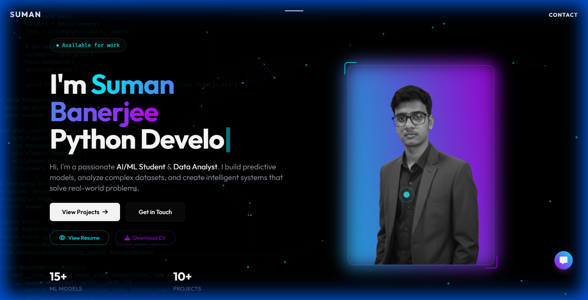
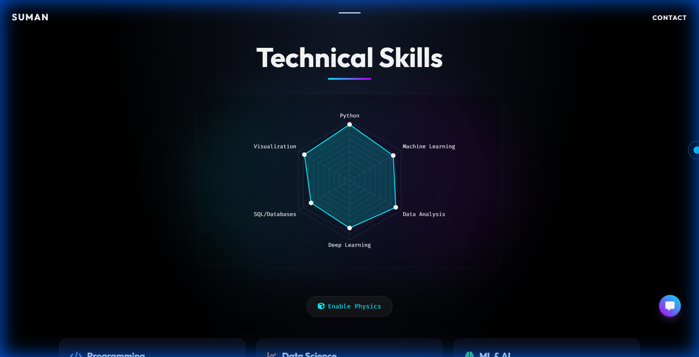

<div align="center">

# 🚀 Suman's Portfolio

### Data Scientist | Machine Learning Engineer | AI Enthusiast


[](https://opensource.org/licenses/MIT)
[](http://makeapullrequest.com)

**A modern, interactive portfolio showcasing data science projects with stunning animations and glassmorphism design**

[View Live Demo](#) • [Report Bug](#) • [Request Feature](#)

</div>

---

## 📸 Preview

<div align="center">

### 🎯 Hero Section


### 💼 Projects Showcase


### 🛠️ Technical Skills


</div>

---

## ✨ Features

<table>
<tr>
<td>

### 🎨 **Visual Excellence**
- **Liquid Loading Animation** - Eye-catching intro with liquid fill effect
- **Glassmorphism UI** - Modern glass effects with spotlight interactions
- **Custom Cursor** - Unique animated cursor for desktop
- **Particle Effects** - Dynamic tsParticles background animations
- **Terminal Mode** - Toggle retro terminal aesthetic with Matrix-style effects

</td>
<td>

### ⚡ **Interactive Elements**
- **3D Flip Cards** - Hover effects on project cards
- **Confusion Matrix Easter Egg** - Hidden interactive data viz
- **Smooth Scrolling** - Seamless navigation experience
- **Responsive Design** - Mobile-first with liquid bottom navigation
- **Sound Effects** - Optional audio feedback (toggle in menu)

</td>
</tr>
</table>

---

## �️ Tech Stack

<div align="center">


</div>

### Core Technologies
- **HTML5** - Semantic markup structure
- **TailwindCSS** - Utility-first CSS framework (CDN)
- **Vanilla JavaScript** - No framework dependencies
- **Chart.js** - Beautiful data visualizations
- **tsParticles** - Particle animation engine
- **Matter.js** - Physics engine for interactive elements
- **Font Awesome** - Icon library

---

## 🚀 Quick Start

### Prerequisites
- Node.js (v14 or higher)
- npm or yarn

### Installation

```bash
# Clone the repository
git clone https://github.com/YOUR_USERNAME/portfolio.git

# Navigate to project directory
cd portfolio

# Install dependencies
npm install

# Start local development server
npm run dev
```

Visit `http://localhost:3000` to view the portfolio locally.


## 📁 Project Structure

```
PORTFOLIO 1/
├── 📄 index.html              # Main HTML file
├── 📁 images/                 # Image assets
├── 📁 sounds/                 # Audio files
├── 📁 screenshots/            # README screenshots
├── 📄 sumanresume.pdf         # Resume PDF
├── 📦 package.json            # Dependencies and scripts
├── ⚙️ vercel.json             # Vercel deployment config
├── 📝 README.md               # This file
└── 🚫 .vercelignore           # Deployment exclusions
```

---

## 🎨 Customization Guide

### 1. **Update Personal Information**

Edit `index.html` to customize:
- Name and title (line ~672, ~800)
- About section content
- Project details
- Contact information

### 2. **Change Color Scheme**

Modify the Tailwind config in `index.html` (lines 64-112):

```javascript
colors: {
    accent: {
        cyan: '#00f2ff',    // Change primary accent
        purple: '#bd00ff',  // Change secondary accent
        pink: '#ff0055',    // Change tertiary accent
    }
}
```

### 3. **Add/Remove Projects**

Find the projects section in `index.html` and add your project cards following the existing structure.

### 4. **Update Skills**

Modify the skills radar chart data in the Chart.js configuration.

### 5. **Replace Resume**

Replace `sumanresume.pdf` with your own PDF file (keep the same filename or update references).

---

## 🎯 Key Features Explained

### � Liquid Loading Animation
A stunning intro animation that fills the name with a liquid effect, creating a memorable first impression.

### 🖥️ Terminal Mode
Press the terminal toggle to transform the entire portfolio into a retro Matrix-style terminal interface with green text and scanlines.

### 🎯 Easter Egg: Confusion Matrix
Click the 🎯 icon on the "Customer Churn Prediction" project to reveal an animated confusion matrix with model metrics.

### 🎨 Glassmorphism Design
Modern frosted glass effects with dynamic spotlight that follows your cursor, creating depth and visual interest.

### 📱 Mobile-First Design
Fully responsive with a beautiful liquid navigation bar at the bottom for mobile devices.

---

## 📊 Performance

- ⚡ **Lighthouse Score**: 95+ Performance
- 🎨 **First Contentful Paint**: < 1.5s
- 🚀 **Time to Interactive**: < 2.5s
- 📦 **Bundle Size**: ~120KB (HTML only)
- 🌐 **CDN Assets**: Cached globally

---

## 🤝 Contributing

Contributions are welcome! Here's how you can help:

1. Fork the repository
2. Create a feature branch (`git checkout -b feature/AmazingFeature`)
3. Commit your changes (`git commit -m 'Add some AmazingFeature'`)
4. Push to the branch (`git push origin feature/AmazingFeature`)
5. Open a Pull Request

---

## 📝 License

This project is licensed under the MIT License - see the [LICENSE](LICENSE) file for details.

---

## 📧 Contact

**Suman Banerjee**

- 📧 Email: [banerjeesuman339@gmail.com](mailto:banerjeesuman339@gmail.com)
- 💼 LinkedIn: [Your LinkedIn Profile](#)
- 🐙 GitHub: [Your GitHub Profile](#)
- 🌐 Portfolio: [Your Live Portfolio URL](#)

---

## � Acknowledgments

- [TailwindCSS](https://tailwindcss.com/) - For the amazing utility-first CSS framework
- [Chart.js](https://www.chartjs.org/) - For beautiful chart visualizations
- [tsParticles](https://particles.js.org/) - For particle animation effects
- [Font Awesome](https://fontawesome.com/) - For the comprehensive icon library
- [Vercel](https://vercel.com/) - For seamless deployment and hosting

---

<div align="center">

### ⭐ Star this repo if you found it helpful!

**Made with ❤️ by Suman Banerjee**

</div>
